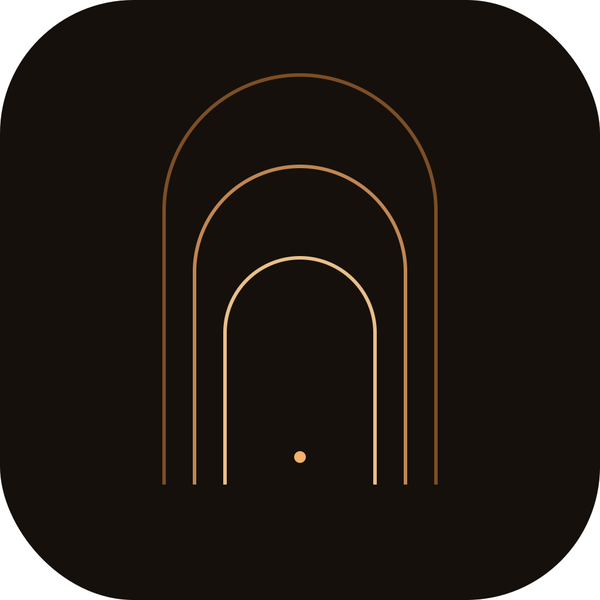
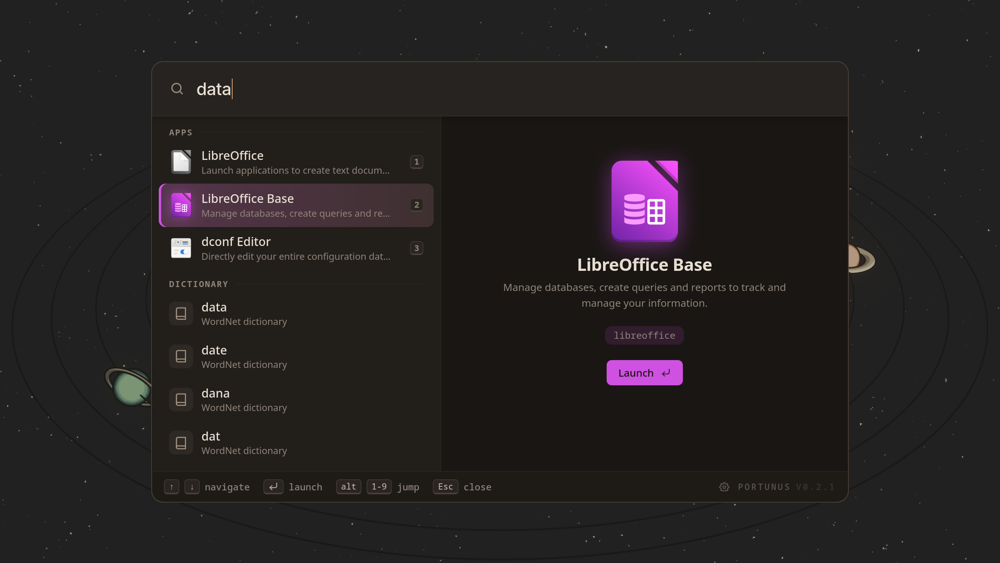
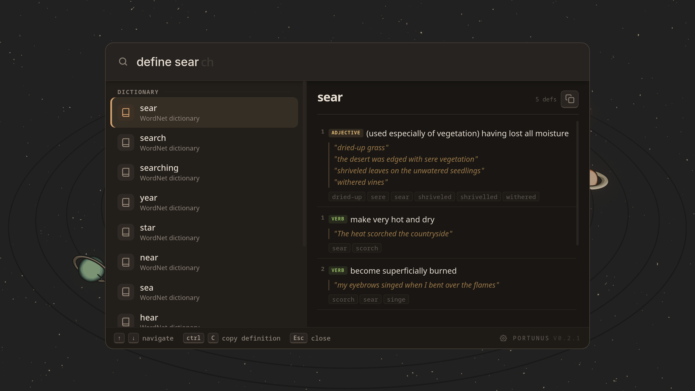
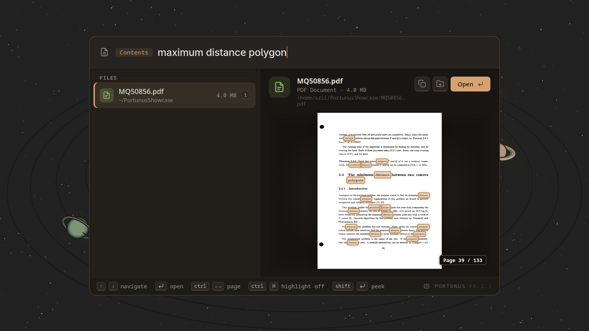
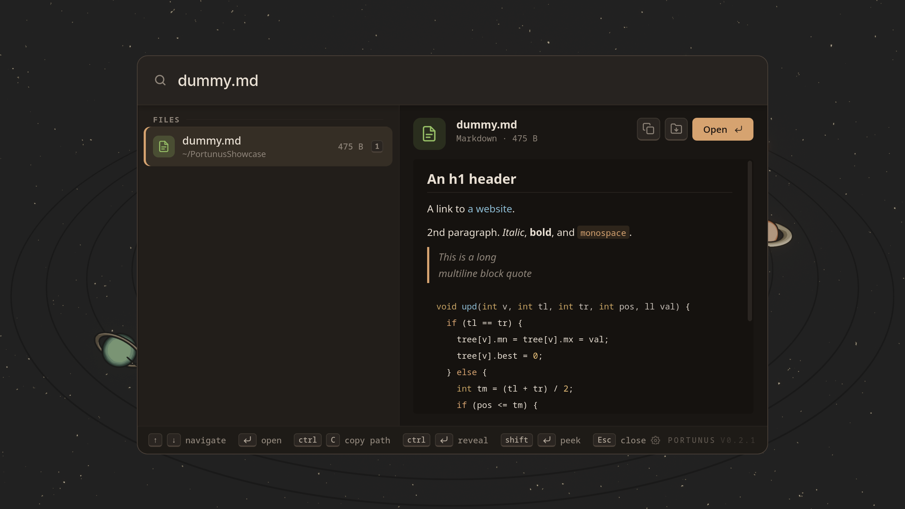
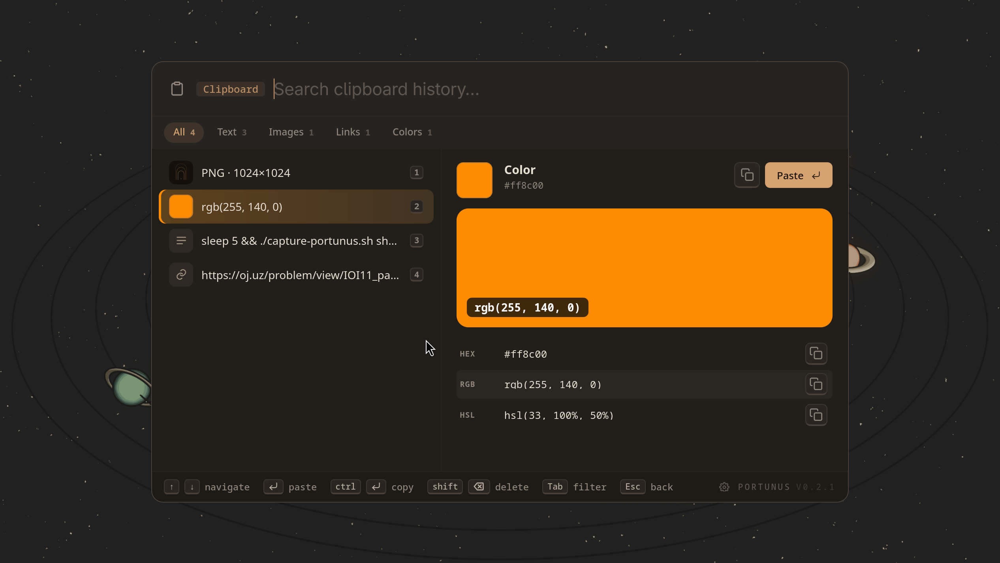

<div align="center">



# Portunus

**A keyboard-first application launcher and search tool for Wayland.**

Find and launch apps, jump to files, do quick math, look up a word, dig through
your clipboard history, or search the text inside your documents. One box, no mouse.

[](https://github.com/SzilBalazs/portunus/releases)
[](LICENSE)
[](#compositor-setup)
[](https://tauri.app)

[Install](#install) · [Usage](#usage) · [Configuration](#configuration) · [Themes](#themes) · [Building](#building-from-source)

<video src="https://github.com/SzilBalazs/portunus/raw/master/.github/assets/hero.mp4" poster=".github/assets/hero.png" width="720" controls muted></video>



</div>

It stays out of your way. The window is hidden until you hit your keybind, and it
vanishes again the second you launch something or press Escape.

## Features

- 🔍 **Fuzzy app & file search** — apps (`.desktop` entries) plus the files and folders you index, ranked by how often you actually open them
- 🧮 **Inline calculator** — type `log2(10^8)` right in the search bar
- 📖 **Dictionary lookup** — `define serendipity` or `dict serendipity` (needs `dictd`)
- 📋 **Clipboard history** — full-text search back through your `cliphist` entries (Wayland)
- 📄 **Content search** — hit `Tab` to search the text inside PDFs, office docs, and images. OCR handles scanned PDFs and screenshots too
- 👁 **Preview panel** — images, PDFs, text files, folder listings, clipboard contents
- ⚡ **No spinners** — the Rust backend indexes on a background thread, so results show up as you type

<table>
  <tr>
    <td width="50%"><br/><sub><b>Dictionary lookup</b></sub></td>
    <td width="50%"><br/><sub><b>Content search (Tab)</b></sub></td>
  </tr>
  <tr>
    <td width="50%"><br/><sub><b>Preview panel</b></sub></td>
    <td width="50%"><br/><sub><b>Clipboard history</b></sub></td>
  </tr>
</table>

## Install

### AppImage (all Wayland distros)

Download the latest release from the [Releases page](https://github.com/SzilBalazs/portunus/releases).

```bash
chmod +x Portunus-x86_64.AppImage
./Portunus-x86_64.AppImage
```

<details>
<summary><b>Optional runtime dependencies</b></summary>

<br/>

The AppImage already bundles everything needed for PDF preview, content search,
and OCR (libpdfium, the poppler tools, and the English tesseract data), so those
work with no extra setup. Two features rely on system tools that are not bundled:

| Package | Feature | Arch | Ubuntu/Debian |
|---|---|---|---|
| `cliphist` + `wl-clipboard` | Clipboard history | `sudo pacman -S cliphist wl-clipboard` | `sudo apt install cliphist wl-clipboard` |
| `dictd` | Dictionary definitions | `sudo pacman -S dictd` | `sudo apt install dictd` |

If you build from source instead of using the AppImage, you also need the PDF and
OCR tools installed on your system: `poppler` (or `poppler-utils`), a `pdfium`
build such as `pdfium-bin`, and tesseract with the language data you want
(`tesseract` + `tesseract-data-eng`).

</details>

## Compositor setup

Portunus runs hidden at startup. Bind `portunus --show` to a key to reveal it; it hides again on launch or Escape.

> [!WARNING]
> Clipboard features need Wayland.

### Hyprland

```conf
# ~/.config/hypr/hyprland.conf
exec-once = /path/to/portunus

bind = CTRL, SPACE, exec, /path/to/portunus --show
bind = SUPER, V, exec, /path/to/portunus --clipboard
```

## Usage

| Query | Result |
|---|---|
| `firefox` | Fuzzy-match apps and files |
| `define serendipity` | Dictionary definition |
| `log2(10^8)` | Calculator |
| `clipboard search term` | Browse clipboard history |
| `Tab` then `invoice 2024` | Search file contents |

## Configuration

On first launch Portunus writes a default config to `~/.config/portunus/config.toml`. Every key is documented inline. Config changes are hot-reloaded without a restart.

### Themes

Pick a theme in **Settings → Appearance**. Nine dark themes ship built-in.

#### Matugen (Material You from your wallpaper)

The **Matugen** theme pulls its colors from an external file, so [matugen](https://github.com/InioX/matugen) can recolor Portunus to match your wallpaper. Copy [`templates/portunus.css`](templates/portunus.css) into your matugen config and wire it up:

```toml
# ~/.config/matugen/config.toml
[templates.portunus]
input_path  = "~/.config/matugen/portunus.css"   # copy of templates/portunus.css
output_path = "~/.config/portunus/matugen.css"
post_hook   = "portunus --reload-theme"
```

Run `matugen image <wallpaper>` (add `--mode light` for a light scheme), then select **Matugen** in Settings → Appearance. Every subsequent matugen run recolors the launcher live via the `post_hook`. If `~/.config/portunus/matugen.css` is missing, the theme falls back to default colors.

## Building from source

<details>
<summary><b>Dependencies</b></summary>

<br/>

| Dependency | Notes |
|---|---|
| Rust stable | via `rustup` |
| Bun | package manager + JS runtime |
| `libwebkit2gtk-4.1-dev` | Tauri WebView |
| `libssl-dev` | |
| `libtesseract-dev` + `libleptonica-dev` | OCR is always built in, so these are required |

</details>

```bash
# Build
bun tauri build

# Type-check only
cargo check --manifest-path src-tauri/Cargo.toml
bun x tsc --noEmit
```

## CLI flags

```
portunus [FLAG]

  --show              Show the launcher window (signals a running instance)
  --clipboard         Show the launcher pre-filled with "clipboard"
  --reindex           Rebuild the content search index
  --reload-config     Reload config from file without restarting
  --reload-extensions Re-discover and reload WASM extensions (picks up rebuilt wasm)
  --reload-theme      Re-read the external matugen.css theme (matugen post_hook)
  --version, -V       Print version and exit
  --help, -h          Show this help message
```

## License

[Apache-2.0](LICENSE)
