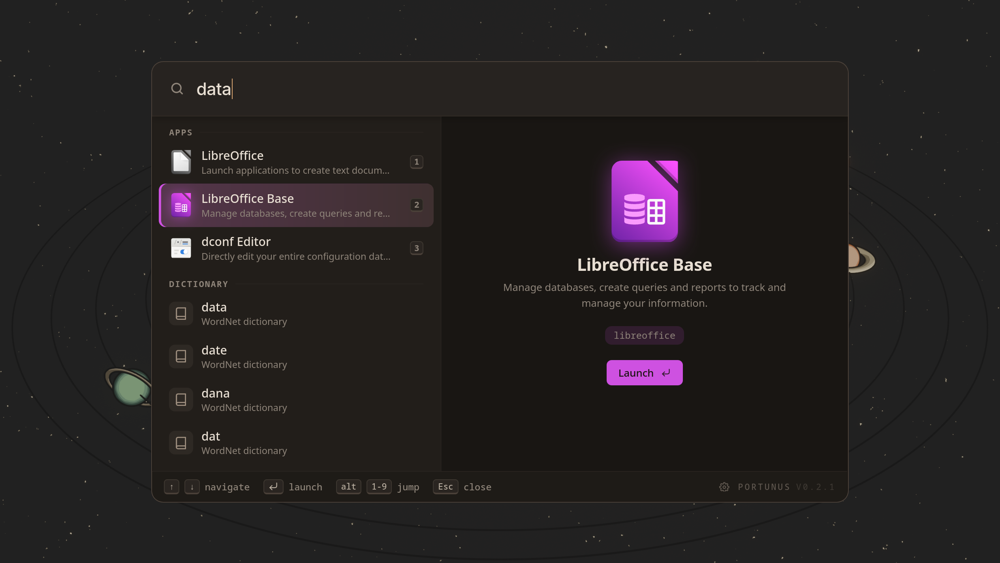
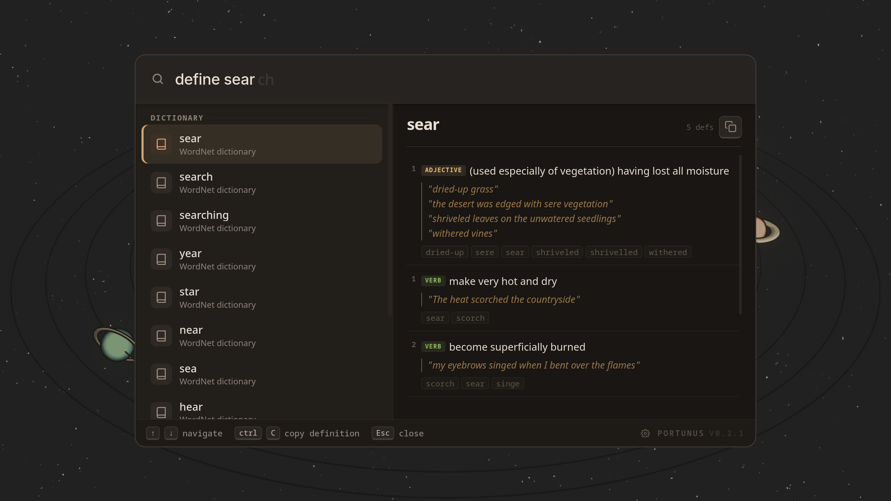
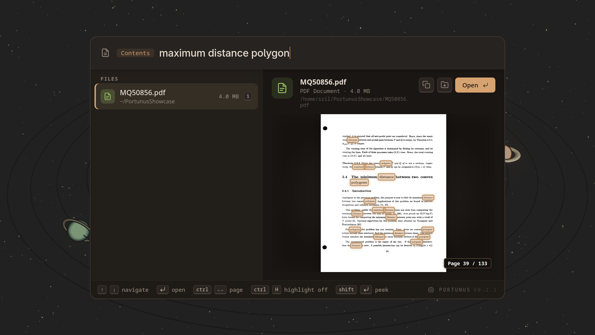
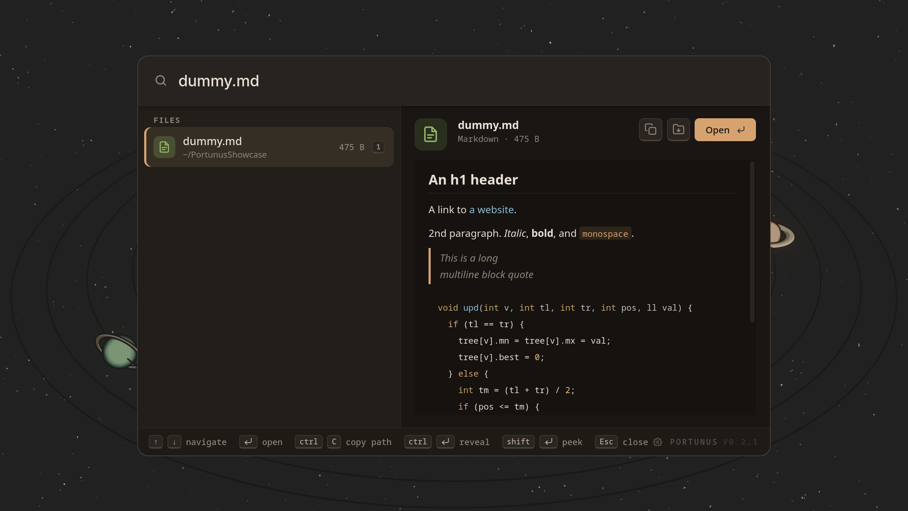
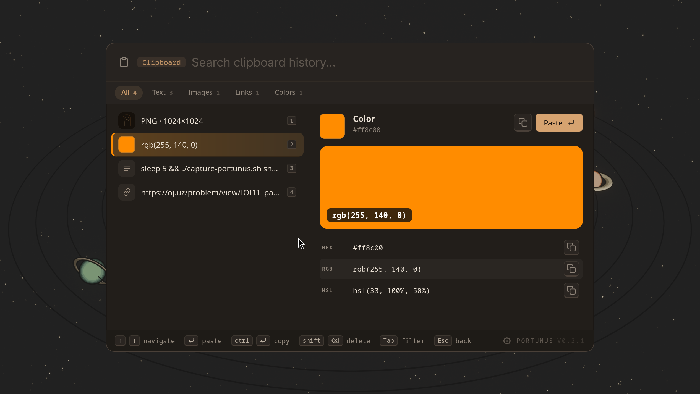

<div align="center">


# Portunus

**A keyboard-first application launcher and search tool for Wayland.**

Find and launch apps, jump to files, do quick math, look up a word, dig through
your clipboard history, or search the text inside your documents. One box, no mouse.

[](https://github.com/SzilBalazs/portunus/releases)
[](LICENSE.txt)
[](#compositor-setup)
[](https://tauri.app)

[Install](#install) · [Usage](#usage) · [Configuration](#configuration) · [Themes](#themes) · [Extensions](#extensions) · [Building](#building-from-source)

<video src="https://github.com/user-attachments/assets/16089ec3-737b-4b20-96c9-b89aa615c4b2" width="720" controls muted></video>



</div>

It stays out of your way. The window is hidden until you hit your keybind, and it
vanishes again the second you launch something or press Escape.

## Features

- 🔍 **Fuzzy app & file search**: apps (`.desktop` entries) plus the files and folders you index, ranked by how often you actually open them
- 🧮 **Inline calculator**: math (`log2(10^8)`), unit conversion (`5km to mi`), currency (`100 usd to eur`), date math (`days until dec 25`), and timezones (`3pm est in cet`)
- 📖 **Dictionary lookup**: `define serendipity`, `dict serendipity`, or `dictionary serendipity` (needs the `dict` client; queries dict.org unless you run a local `dictd`)
- 📋 **Clipboard history**: full-text search back through your `cliphist` entries (Wayland)
- 📄 **Content search**: hit `Tab` to search the text inside PDFs, office docs, and images. OCR handles scanned PDFs and screenshots too
- 👁 **Preview panel**: images, PDFs, text files, folder listings, clipboard contents
- 🧩 **Extensions**: sandboxed wasm modules add new search providers, commands, and previews; browse and install them by typing `marketplace` in the launcher
- ⚡ **No spinners**: the Rust backend indexes on a background thread, so results show up as you type

<table>
  <tr>
    <td width="50%"><br/><sub><b>Dictionary lookup</b></sub></td>
    <td width="50%"><br/><sub><b>Content search (Tab)</b></sub></td>
  </tr>
  <tr>
    <td width="50%"><br/><sub><b>Preview panel</b></sub></td>
    <td width="50%"><br/><sub><b>Clipboard history</b></sub></td>
  </tr>
</table>

## Install

Download a package from the [Releases page](https://github.com/SzilBalazs/portunus/releases). All of them are **x86_64 only**.
On other architectures use the Nix flake or build from source.

### Arch Linux

The release ships a ready-to-build `PKGBUILD` for `portunus-bin`, which installs
the prebuilt `.deb` above. Its `sha256sum` is filled in by CI at release time, so
there is nothing to edit:

```bash
curl -fLO https://github.com/SzilBalazs/portunus/releases/latest/download/PKGBUILD
makepkg -si
```

Read the `PKGBUILD` before building, as you would for anything from the AUR.

### Debian / Ubuntu (`.deb`)

```bash
sudo apt install ./portunus_*_amd64.deb
```

The `.deb` links your system's own WebKitGTK, so the launcher never carries a
stale bundled WebView. This is the lowest-latency option. It still bundles
libpdfium, the poppler tools, and the English tesseract data under
`/usr/lib/portunus`, so PDF preview, content search, and OCR need nothing extra.

### AppImage (portable)

```bash
chmod +x portunus_*_amd64.AppImage
./portunus_*_amd64.AppImage
```

Self-contained and runs anywhere, but it is built on Ubuntu 24.04, so it needs
**glibc 2.39 or newer** (Ubuntu 24.04+, Debian 13+, Arch, Fedora 40+). On older
distros the AppImage will not start; install the `.deb` instead.

<details>
<summary><b>Optional runtime dependencies</b></summary>

<br/>

Every package above bundles what PDF preview, content search, and OCR need
(libpdfium, the poppler tools, and the English tesseract data), so those work
with no extra setup. Two features rely on system tools that are not bundled:

| Package | Feature | Arch | Ubuntu/Debian |
|---|---|---|---|
| `cliphist` + `wl-clipboard` | Clipboard history | `sudo pacman -S cliphist wl-clipboard` | `sudo apt install cliphist wl-clipboard` |
| `wtype` | Smart paste (auto Ctrl+V) | `sudo pacman -S wtype` | `sudo apt install wtype` |
| `dict` client | Dictionary definitions | `sudo pacman -S dictd` | `sudo apt install dict` |

Portunus shells out to the `dict` **client**, not to a server. Debian and Ubuntu
split the two, so install `dict` there; `dictd` is the server and does not ship
the `dict` binary at all. Arch's `dictd` package contains both. Either way you
get a `dict.conf` that tries `localhost` first and falls back to `dict.org`, so
definitions work immediately but go over the network. For offline lookups, run a
local `dictd` carrying the WordNet (`wn`) database.

**Settings → Providers** lists every optional dependency and whether Portunus can
currently find it; the first-launch wizard shows the same check.

If you build from source instead of installing a package, you also need the PDF and
OCR tools on your system: `poppler` (or `poppler-utils`), a `pdfium`
build such as `pdfium-bin`, and tesseract with the language data you want
(`tesseract` + `tesseract-data-eng`).

</details>

### Nix (flake)

```bash
nix run github:SzilBalazs/portunus
```

Prebuilt binaries come from `portunus.cachix.org`. Nix applies a flake's own
substituter list only for trusted users, so unless you are one, add the cache to
your configuration. Without it Nix quietly builds the whole app from source:

```nix
# NixOS: configuration.nix
nix.settings = {
  substituters = [ "https://portunus.cachix.org" ];
  trusted-public-keys = [
    "portunus.cachix.org-1:byhkNv2iSgx4QQmrwgmtzYHFY+ztYe8+3vcAStcDemI="
  ];
};
```

For a one-off run, `--accept-flake-config` does the same job:

```bash
nix run --accept-flake-config github:SzilBalazs/portunus
```

The wrapper puts libpdfium, the poppler tools, cliphist, wl-clipboard, wtype, the
`dict` client and the tesseract data on the package's own path, so PDF preview,
clipboard history, content search and OCR work out of the box.

Dictionary lookups need one extra step. The `dict` client reads its server list
from `/etc/dict.conf`, which a plain `nix run` never creates, and it has no
built-in default. With no config it exits with `'dict.conf' doesn't specify any
dict server`. Point it at the public server:

```bash
echo 'server dict.org' >> ~/.dictrc
```

On NixOS you can get fully offline lookups instead by running the server locally.
WordNet is already in the default database set:

```nix
services.dictd.enable = true;
```

## Compositor setup

Portunus runs hidden at startup. Bind `portunus --toggle` to a key to reveal it; press it again (or launch/Escape) to hide it.

> [!WARNING]
> Clipboard features need Wayland.

### Hyprland

```conf
# ~/.config/hypr/hyprland.conf
exec-once = /path/to/portunus

bind = CTRL, SPACE, exec, /path/to/portunus --toggle
bind = SUPER, V, exec, /path/to/portunus --clipboard
```

## Usage

| Query | Result |
|---|---|
| `firefox` | Fuzzy-match apps and files |
| `define serendipity` | Dictionary definition |
| `log2(10^8)` | Calculator |
| `5km to mi`, `100 usd to eur` | Unit & currency conversion |
| `now + 3 weeks`, `time in tokyo` | Date math & timezones |
| `clipboard search term` | Browse clipboard history |
| `Tab` then `invoice 2024` | Search file contents |

## Configuration

On first launch Portunus writes a default config to `~/.config/portunus/config.toml`. Config changes are hot-reloaded without a restart.

### Themes

Pick a theme in **Settings → Appearance**. Eight dark themes ship built-in, plus a Matugen theme that pulls its colors from your wallpaper.

#### Matugen (Material You from your wallpaper)

The **Matugen** theme pulls its colors from an external file, so [matugen](https://github.com/InioX/matugen) can recolor Portunus to match your wallpaper. Copy [`templates/portunus.css`](templates/portunus.css) into your matugen config and wire it up:

```toml
# ~/.config/matugen/config.toml
[templates.portunus]
input_path  = "~/.config/matugen/portunus.css"   # copy of templates/portunus.css
output_path = "~/.config/portunus/matugen.css"
post_hook   = "portunus --reload-theme"
```

Run `matugen image <wallpaper>` (add `--mode light` for a light scheme), then select **Matugen** in Settings → Appearance. Every subsequent matugen run recolors the launcher live via the `post_hook`. If `~/.config/portunus/matugen.css` is missing, the theme falls back to default colors.

## Extensions

Portunus can be extended with sandboxed WebAssembly **extensions** that add
new search providers, launcher commands, previews, and background refreshers.
Type `marketplace` in the launcher to browse and install them. Each install
shows the permissions it asks for before you confirm. **Settings → Extensions**
manages what you already have: update checks, sideloading a local `.portext`, and
rescans.

Reference extensions and the marketplace index live in a dedicated repo:
**[SzilBalazs/portunus-extensions](https://github.com/SzilBalazs/portunus-extensions)**.
To write your own, see [EXTENSIONS.md](EXTENSIONS.md) and run `portunus ext new`.

## Building from source

<details>
<summary><b>Dependencies</b></summary>

<br/>

| Dependency | Notes |
|---|---|
| Rust stable | via `rustup` |
| Bun | package manager + JS runtime |
| `libwebkit2gtk-4.1-dev` | Tauri WebView |
| `libssl-dev` | |
| `libtesseract-dev` + `libleptonica-dev` | OCR is always built in, so these are required |

</details>

```bash
# Build
bun tauri build

# Type-check only
cargo check --manifest-path src-tauri/Cargo.toml
bun x tsc --noEmit
```

With Nix, the repo's flake provides all of the above: `nix develop` enters a
dev shell with the full toolchain, and `nix build` produces the package in
`result/` (see `flake.nix` and `packaging/nix/`).

## CLI flags

```
portunus [FLAG]

  --show              Show the launcher window (signals a running instance)
  --close             Close the launcher window (signals a running instance)
  --toggle            Toggle the launcher window (signals a running instance)
  --clipboard         Show the launcher pre-filled with "clipboard"
  --reindex           Rebuild the content search index
  --reload-config     Reload config from file without restarting
  --reload-extensions Re-discover and reload WASM extensions (picks up rebuilt wasm)
  --reload-theme      Re-read the external matugen.css theme (matugen post_hook)
  --version, -V       Print version and exit
  --help, -h          Show this help message
```

## License

[Apache-2.0](LICENSE.txt)
